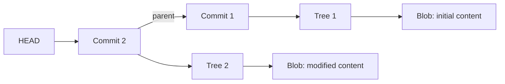

# GitLike: Content Addressable Storage System in Java

**A minimal Git-style version control engine built from scratch in Java 21 to learn how Git stores and links data internally.**

Every file snapshot, directory listing and commit is stored as an immutable object named by the **SHA-1 hash of its contents**. Identical content is stored only once, and the commit history is a chain of hash references.

---

## Table of Contents

- [Key Features](#key-features)
- [Why I Built This](#why-i-built-this)
- [How It Works](#how-it-works)
- [Storage Layout](#storage-layout)
- [Data Structures and Algorithms Used](#data-structures-and-algorithms-used)
- [Getting Started](#getting-started)
- [Usage](#usage)
- [Project Structure](#project-structure)
- [Testing](#testing)
- [Limitations](#limitations)
- [Roadmap](#roadmap)
- [Author](#author)

---

## Key Features

- **Content-addressable object store:** objects are saved under their SHA-1 hash, so identical content is deduplicated automatically
- **Repository initialization** that creates a `.minigit` directory with an objects store
- **Staging and commits:** stage files with `add`, then snapshot them with `commit -m`
- **Commit history:** each commit stores a tree hash, a parent hash, a message and a timestamp, and `log` walks the chain back from `HEAD`
- **Checkout:** restore the files of any earlier commit by hash
- **Line-based diff** between two files, implemented with the Longest Common Subsequence algorithm
- **Command dispatcher** (`MiniGitCLI`) supporting `init`, `add`, `commit`, `log`, `diff` and `checkout`
- **Plain Java 21:** no external libraries

## Why I Built This

Most developers use Git every day without knowing how it stores data. This project implements the core ideas directly (hashing, immutable objects, deduplication and linked commit history) using data structures and object-oriented design in Java.

## How It Works

Three kinds of objects are stored, each named by the SHA-1 hash of its content:

| Object | Content | Example |
|---|---|---|
| **Blob** | Raw text of a file | `Initial content` |
| **Tree** | One line per staged file: `<path> <blobHash>` | `test.txt 0011aa...` |
| **Commit** | `tree`, optional `parent`, `message`, `date` lines | `tree 2d7f...` |



**Commit flow:**
1. `add <file>` reads the file, hashes it, writes a blob object and records `path -> blobHash` in the staging area.
2. `commit -m "<message>"` writes a tree object from the staging area, then writes a commit object that points to that tree and to the previous commit, and moves `HEAD` to the new commit.
3. `log` starts at `HEAD` and follows each commit's parent hash until there is none.
4. `checkout <hash>` reads the commit, reads its tree, rewrites each file from its blob, and moves `HEAD` to that commit.

**Deduplication:** because an object's name is its content hash, writing the same content twice produces the same file, so it is stored once.

## Storage Layout

```
.minigit/
├── HEAD            # hash of the latest commit (created on first commit)
└── objects/
    ├── 0011aa24...   # blob, tree or commit, named by its 40-character SHA-1
    ├── 2d7f5701...
    └── ...
```

Objects are stored as plain, uncompressed files in a single flat `objects` directory.

## Data Structures and Algorithms Used

| Concept | Where it is used |
|---|---|
| **Hashing (SHA-1)** | Naming and deduplicating all objects |
| **HashMap** | Staging area (`path -> blobHash`) |
| **Linked list via parent pointers** | Commit history, traversed from `HEAD` |
| **Dynamic programming (LCS)** | Line diff, with an `O(m x n)` table |
| **Stack** | Reversing the diff output after backtracking through the LCS table |
| **Serialization and parsing** | Converting commits and trees to and from text |

## Getting Started

### Prerequisites

- **JDK 21** (the project is compiled for Java 21)

### Build

```bash
git clone https://github.com/Siddharthkothiyal/-Content_addressable_storage_systemGitLike.git
cd -Content_addressable_storage_systemGitLike
javac -d out src/main/java/minigit/*.java
```

This compiles the sources into `out/minigit/` (10 classes, including the nested `Tree.Entry`). The `out/` folder is build output and is not committed.

### Run the demo

`Main.java` creates a `test_repo` folder and runs the full flow: init, add, commit, modify, commit again, log, then checkout the first commit.

```bash
java -cp out minigit.Main
```

The demo prints both commit hashes, the commit history, and the file content restored by the checkout (`Initial content`).

Run it on a clean folder: delete `test_repo` before running again, because `init` refuses to re-initialize an existing repository.

```bash
rm -rf test_repo        # Windows (cmd): rmdir /s /q test_repo
```

## Usage

### As a library

```java
Repository repo = new Repository("my_project");
repo.initRepo();
repo.addFile("notes.txt");
String hash = repo.commit("first commit");
repo.logHistory();
repo.checkout(hash);
```

### Through the command dispatcher

```java
MiniGitCLI cli = new MiniGitCLI("my_project");
cli.executeCommand(new String[]{"init"});
cli.executeCommand(new String[]{"add", "notes.txt"});
cli.executeCommand(new String[]{"commit", "-m", "first commit"});
cli.executeCommand(new String[]{"log"});
cli.executeCommand(new String[]{"diff", "a.txt", "b.txt"});
cli.executeCommand(new String[]{"checkout", "<commit-hash>"});
```

| Command | What it does |
|---|---|
| `init` | Initialize a new repository |
| `add <file>` | Stage a file |
| `commit -m "message"` | Create a commit from the staged files |
| `log` | Show commit history |
| `diff <file1> <file2>` | Show line differences (`+` added, `-` removed) |
| `checkout <commit-hash>` | Restore the files of a previous commit |

## Project Structure

```
.
├── src/main/java/minigit/
│   ├── Main.java          # Demo of the full workflow
│   ├── MiniGitCLI.java    # Command parsing and dispatch
│   ├── Repository.java    # init, add, commit, log, checkout
│   ├── Commit.java        # Commit model, serialize and deserialize
│   ├── DiffUtil.java      # LCS-based line diff
│   ├── HashUtil.java      # SHA-1 helper
│   ├── Blob.java          # Byte-based blob object
│   ├── Tree.java          # Tree entries with mode, type, hash, name
│   └── Index.java         # Staging index with on-disk persistence
├── test_repo/             # Sample repository produced by the demo
└── README.md
```

`Blob`, `Tree`, `Index` and `HashUtil` are standalone building blocks (byte-safe blobs, typed tree entries, a persistent index). `Repository` currently uses its own simpler object handling, and wiring these classes in is on the roadmap.

## Testing

The demo in `Main.java` exercises the complete flow end to end: init, add, commit, modify, commit, log and checkout. Automated JUnit tests are planned (see the roadmap).

## Limitations

- **Repository state is held in memory.** The staging area and `HEAD` pointer are not reloaded from disk when a new `Repository` object is created, so the full flow works within one run (as in the demo), but not across separate program runs.
- **Text files only.** File contents are read and written as strings.
- **Flat trees.** A tree lists staged file paths directly. Nested directory trees are not built.
- **No branches, merge or remotes.**
- **Checkout** restores the files of a commit but does not delete files that are not part of it.
- **`MiniGitCLI` has no `main` method.** It is a command dispatcher you call from code, and `Main` is the runnable demo.
- **SHA-1** matches Git's classic design but is no longer collision-resistant, and hashes here are computed over the content only, without Git's object header.
- Educational project, not a replacement for Git.

## Roadmap

- Load `HEAD` and the staging area from disk (using the existing `Index` class) so state persists across runs
- Add a `main` entry point for command-line use
- Add JUnit tests for hashing, commits, history, checkout and diff
- Use `Blob` (byte-safe) and `Tree` (typed entries) inside `Repository`, with nested directory trees
- Add branches and merge
- Shard the object directory by hash prefix and compress objects
- Switch to SHA-256 behind a hashing interface

## Author

**Siddharth Kumar**
GitHub: [@Siddharthkothiyal](https://github.com/Siddharthkothiyal)
